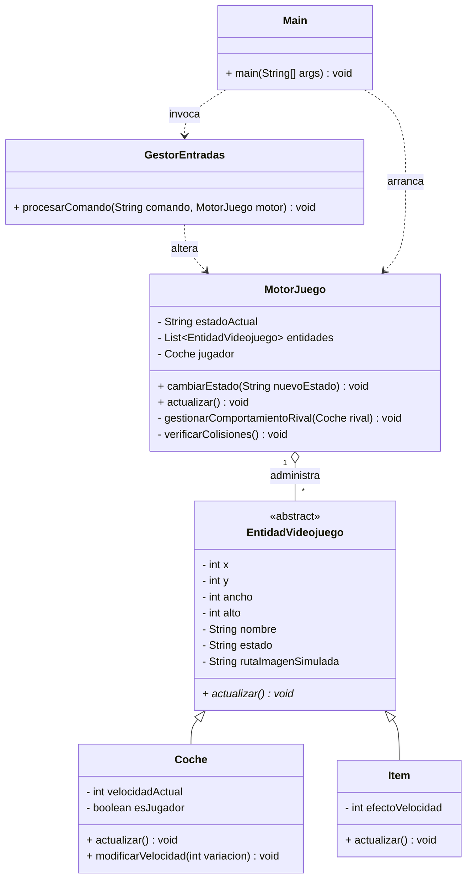

# 🏎️ Motor de Videojuego 2D Grid/Scroll - IA-Drive Racing

## 📋 Temática Elegida
El proyecto implementa la lógica interna de control para un videojuego de **carreras automovilísticas en scroll vertical**. El jugador puede controlar la aceleración y frenada de su vehículo a través de un carril, interactuando dinámicamente con coches competidores controlados por Inteligencia Artificial y con elementos de la calzada que alteran las físicas del vehículo (como potenciadores de *Nitro* o trampas de *Manchas de Aceite*).

---

## 🏗️ Arquitectura del Software
El diseño se rige bajo una arquitectura orientada a objetos minimalista estructurada exactamente en **6 clases**, garantizando un acoplamiento débil y alta cohesión:

1. **`Main`**: Actúa como la clase conductora/orquestadora. Simula de forma determinista las acciones síncronas del usuario y el procesado secuencial del ciclo de juego por consola.
2. **`MotorJuego`**: Es el cerebro dinámico del juego. Controla los estados globales mediante una máquina de estados finitos y almacena/gestiona las referencias de la memoria de las entidades del mapa.
3. **`EntidadVideojuego`**: Clase abstracta base que unifica el motor físico bidimensional (coordenadas $x, y$, dimensiones de caja $w, h$), estados gráficos y nombres de catálogo.
4. **`Coche`**: Extensión especializada de la entidad. Añade variables de velocidad lineal del motor y discrimina entre el rol del jugador humano y las instancias NPC de la IA.
5. **`Item`**: Extensión estática de la entidad que encapsula modificadores numéricos del entorno encargados de inyectar fuerzas delta de velocidad a los vehículos que intersectan su área.
6. **`GestorEntradas`**: Componente traductor. Aísla las peticiones crudas de la interfaz o el hardware simulado (strings de comando) y las convierte en llamadas a métodos de la lógica de negocio del motor.

---

## 📊 Diagramas de Arquitectura UML

### 1. Diagrama de Clases (Mermaid)


### 2. Diagrama de Casos de Uso (Mermaid)
```mermaid
gestureDiagram
graph TD
    Jugador((Actor: Jugador))
    
    CU1[CU-01 Iniciar Partida]
    CU2[CU-02 Controlar Aceleración]
    CU3[CU-03 Pausar Juego]
    
    Jugador --> CU1
    Jugador --> CU2
    Jugador --> CU3
```

---

## 📄 Especificación de Casos de Uso

| Campo | Descripción |
| :--- | :--- |
| **Nombre** | **CU-01 Iniciar Partida** |
| **Objetivo** | Transicionar el juego desde el menú principal hacia el estado activo de carrera, desplegando el escenario básico. |
| **Actor Principal** | Jugador. |
| **Precondiciones** | El estado del sistema debe ser exactamente `MENU`. No debe existir ninguna partida instanciada previamente. |
| **Flujo Principal**| 1. El jugador envía el comando de entrada `INICIAR`. <br>2. El sistema valida el estado y muta a `JUGANDO`. <br>3. Se instancian en memoria el coche del jugador, los rivales IA y los ítems de pista. <br>4. Se inicia el flujo del Game Loop (`actualizar()`). |
| **Flujos Alternativos**| **1a. Partida en curso:** Si el estado es distinto a `MENU`, el sistema rechaza la llamada emitiendo un log de advertencia en consola y mantiene el estado previo. |
| **Postcondiciones** | El motor queda configurado en estado `JUGANDO` con la lista de entidades poblada. |
| **Reglas de Negocio**| No se puede iniciar si ya hay una partida en curso. |

<br>

| Campo | Descripción |
| :--- | :--- |
| **Nombre** | **CU-02 Controlar Aceleración** |
| **Objetivo** | Incrementar la velocidad lineal del vehículo del jugador para avanzar más rápido por el circuito. |
| **Actor Principal** | Jugador. |
| **Precondiciones** | El motor de juego debe estar obligatoriamente en estado `JUGANDO`. |
| **Flujo Principal**| 1. El jugador introduce el comando `ACELERAR`. <br>2. `GestorEntradas` intercepta el comando y extrae la referencia del coche jugador. <br>3. El sistema añade de manera controlada un diferencial positivo fijo a la velocidad actual del vehículo. <br>4. El siguiente ciclo del bucle calcula la nueva posición Y en base a dicha velocidad. |
| **Flujos Alternativos**| **2a. Juego en Pausa o Menú:** Si el motor está en pausa, la entrada se ignora informando que los controles están deshabilitados transitoriamente. |
| **Postcondiciones** | La velocidad del coche del jugador aumenta reflejándose inmediatamente en los logs métricos del siguiente ciclo. |
| **Reglas de Negocio**| El aumento de velocidad no puede dar un resultado negativo. |

---

## 🤖 Bitácora del Uso de Inteligencia Artificial

### Herramienta utilizada y rol asignado
* **Herramienta**: ChatGPT / Claude (Modelos LLM Avanzados).
* **Rol Asignado**: Arquitecto de Software Senior y Líder Técnico Experto en Desarrollo de Motores Gráficos en Java.

### Muestra de Prompts Exactos
> **Prompt 1 (Diseño de la estructura básica)**:  
> *"Actúa como un arquitecto de software senior. Necesito diseñar la lógica de un motor de videojuego 2D de carreras por consola en Java utilizando un número estricto máximo de 6 clases. Debe tener una clase abstracta EntidadVideojuego con propiedades espaciales (x,y,w,h) y herencia para Coches e Ítems. Incluye encapsulación completa y un GestorEntradas analizando comandos de texto tipo 'ACELERAR' o 'INICIAR'. No uses frameworks gráficos."*

> **Prompt 2 (Lógicas avanzadas de colisión e IA)**:  
> *"Asísteme ahora para añadir lógica móvil avanzada en la clase MotorJuego. Añade un detector matemático de colisiones usando el algoritmo Axis-Aligned Bounding Box (AABB) para ver si los coches pisan los ítems de la calzada, modificando sus velocidades. Además, implementa un comportamiento NPC para los coches rivales: si están lejos patrullan, pero si la distancia relativa en Y con el jugador es menor de 50 metros, entran en estado perseguir de forma agresiva."*

### Control de Errores de la IA
Durante la sesión de co-programación, la IA incurrió en un problema de **sobre-ingeniería y violación de restricciones**. El modelo intentó inyectar interfaces de escucha complejas (`InputListener`), un sistema de hilos concurrentes en tiempo real para el bucle y dividió las entidades en archivos independientes para cada tipo de ítem (*Aceite*, *Moneda*, *Turbo*), superando la barrera obligatoria de **máximo 6 clases**.

* **Instrucción de rectificación manual**: *"Alto. Estás violando la restricción de diseño de la rúbrica. No puedo superar las 6 clases totales en el proyecto. Elimina las clases individuales de ítems y unifícalas en una única entidad paramétrica llamada `Item` que use una propiedad de fuerza/efecto para alterar la velocidad. Borra la concurrencia nativa de Java y mantén el ciclo loop puramente secuencial simulado mediante llamadas explícitas al método `actualizar()` en la clase Main."* La IA corrigió de inmediato el código compactándolo al formato reglamentario presentado.

### Reflexión Crítica
* **Ventajas**: Acelera drásticamente el proceso de andamiaje y la escritura de código repetitivo (*boilerplate code*), como la inserción limpia de getters, setters y la maquetación en sintaxis estructurada de Mermaid para los diagramas de documentación de requisitos.
* **Peligros**: El programador puede perder el hilo del control de la lógica si acepta ciegamente el código del modelo. Las IA tienden a la sobre-ingeniería de patrones de diseño corporativos (como el patrón Factory o Observer complejo) que rompen los límites académicos simples, exigiendo supervisión crítica constante.