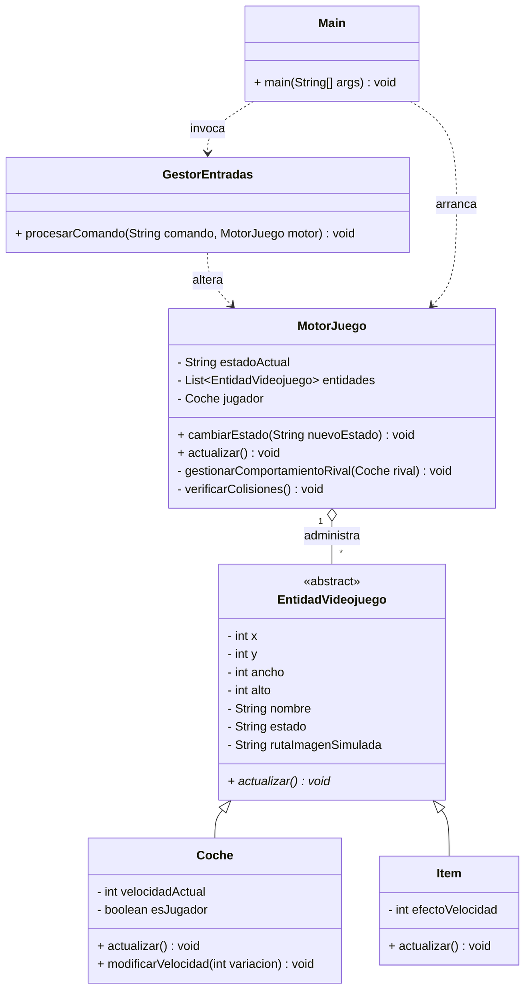
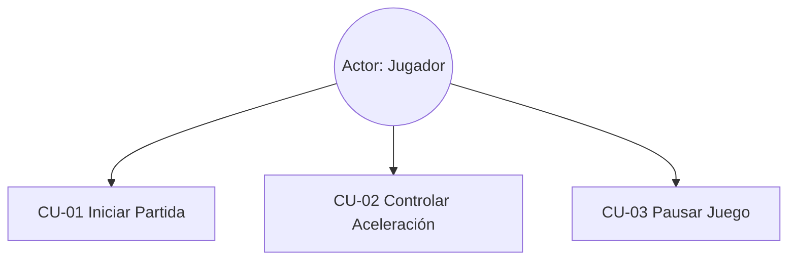

# 🏎️ Motor de Videojuego 2D Grid/Scroll - IA-Drive Racing

## 📋 Temática Elegida
El proyecto implementa la lógica interna de control para un videojuego de **carreras automovilísticas en scroll vertical**. El jugador puede controlar la aceleración y frenada de su vehículo a través de un carril, interactuando dinámicamente con coches competidores controlados por Inteligencia Artificial y con elementos de la calzada que alteran las físicas del vehículo (como potenciadores de *Nitro* o trampas de *Manchas de Aceite*).

---

## 🏗️ Arquitectura del Software
El diseño se rige bajo una arquitectura orientada a objetos minimalista estructurada exactamente en **6 clases**, garantizando un acoplamiento débil y alta cohesión:

1. **`Main`**: Actúa como la clase conductora/orquestadora. Simula de forma determinista las acciones síncronas del usuario y el procesado secuencial del ciclo de juego por consola.
2. **`MotorJuego`**: Es el cerebro dinámico del juego. Controla los estados globales mediante una máquina de estados finitos y almacena/gestiona las referencias de la memoria de las entidades del mapa.
3. **`EntidadVideojuego`**: Clase abstracta base que unifica el motor físico bidimensional (coordenadas $x, y$, dimensiones de caja $w, h$), estados gráficos y nombres de catálogo.
4. **`Coche`**: Extensión especializada de la entidad. Añade variables de velocidad lineal del motor y discrimina entre el rol del jugador humano y las instancias NPC de la IA.
5. **`Item`**: Extensión estática de la entidad que encapsula modificadores numéricos del entorno encargados de inyectar fuerzas delta de velocidad a los vehículos que intersectan su área.
6. **`GestorEntradas`**: Componente traductor. Aísla las peticiones crudas de la interfaz o el hardware simulado (strings de comando) y las convierte en llamadas a métodos de la lógica de negocio del motor.

---

## 📊 Diagramas de Arquitectura UML

### 1. Diagrama de Clases (Mermaid)

### 2. Diagrama de Casos de Uso (Mermaid)

---

## 📄 Especificación de Casos de Uso

| Campo | Descripción |
| :--- | :--- |
| **Nombre** | **CU-01 Iniciar Partida** |
| **Objetivo** | Transicionar el juego desde el menú principal hacia el estado activo de carrera, desplegando el escenario básico. |
| **Actor Principal** | Jugador. |
| **Precondiciones** | El estado del sistema debe ser exactamente `MENU`. No debe existir ninguna partida instanciada previamente. |
| **Flujo Principal**| 1. El jugador envía el comando de entrada `INICIAR`.  2. El sistema valida el estado y muta a `JUGANDO`.  3. Se instancian en memoria el coche del jugador, los rivales IA y los ítems de pista.  4. Se inicia el flujo del Game Loop (`actualizar()`). |
| **Flujos Alternativos**| **1a. Partida en curso:** Si el estado es distinto a `MENU`, el sistema rechaza la llamada emitiendo un log de advertencia en consola y mantiene el estado previo. |
| **Postcondiciones** | El motor queda configurado en estado `JUGANDO` con la lista de entidades poblada. |
| **Reglas de Negocio**| No se puede iniciar si ya hay una partida en curso. |

 

| Campo | Descripción |
| :--- | :--- |
| **Nombre** | **CU-02 Controlar Aceleración** |
| **Objetivo** | Incrementar la velocidad lineal del vehículo del jugador para avanzar más rápido por el circuito. |
| **Actor Principal** | Jugador. |
| **Precondiciones** | El motor de juego debe estar obligatoriamente en estado `JUGANDO`. |
| **Flujo Principal**| 1. El jugador introduce el comando `ACELERAR`.  2. `GestorEntradas` intercepta el comando y extrae la referencia del coche jugador.  3. El sistema añade de manera controlada un diferencial positivo fijo a la velocidad actual del vehículo.  4. El siguiente ciclo del bucle calcula la nueva posición Y en base a dicha velocidad. |
| **Flujos Alternativos**| **2a. Juego en Pausa o Menú:** Si el motor está en pausa, la entrada se ignora informando que los controles están deshabilitados transitoriamente. |
| **Postcondiciones** | La velocidad del coche del jugador aumenta reflejándose inmediatamente en los logs métricos del siguiente ciclo. |
| **Reglas de Negocio**| El aumento de velocidad no puede dar un resultado negativo. |

---

## 🤖 Bitácora del Uso de Inteligencia Artificial

### Herramienta utilizada y rol asignado
* **Herramienta**: ChatGPT / Claude (Modelos LLM Avanzados).
* **Rol Asignado**: Arquitecto de Software Senior y Líder Técnico Experto en Desarrollo de Motores Gráficos en Java.

### Muestra de Prompts Exactos
> **Prompt 1 (Generación de la arquitectura y lógica inicial)**:  
> *"Se pide diseñar e implementar de forma asistida por IA la lógica interna de control (sin interfaz gráfica) de un núcleo para un videojuego tipo scroll o cuadrícula 2D. La temática del juego son carreras de coches en las que puedes obtener objetos que te hacen ir más rápido o más lento. Respeta la restricción máxima de 6 clases (Main, MotorJuego, EntidadVideojuego, GestorEntradas, Coche e Item) y añade las funciones avanzadas de un detector matemático de colisiones AABB y comportamiento dinámico de la IA enemiga por distancia. Detalla cada paso de Git-Flow y el README.md."*

> **Prompt 2 (Depuración técnica y resolución de bloqueos)**:  
> *"Al intentar compilar en la Fase 2, la clase GestorEntradas pasa por parámetro el objeto MotorJuego, el cual todavía no se ha desarrollado formalmente porque pertenece a las funciones avanzadas de la Fase 3. Además, Git en PowerShell no reconoce las rutas cortas de los archivos y me arroja un error 'pathspec did not match any files'. ¿Cómo reestructuramos el plan para crear un esqueleto base y solucionar las rutas exactas de los commits sin violar las restricciones?"*

> **Prompt 3 (Corrección del renderizado en GitHub)**:  
> *"La sección del diagrama de casos de uso en el README.md me muestra un recuadro de error que dice 'Unable to render rich display: No diagram type detected matching given configuration for text: gestureDiagram'. ¿Cómo corrijo la sintaxis del bloque de código Markdown para que GitHub renderice el esquema de Mermaid correctamente de forma nativa?"*

### Control de Errores de la IA
Durante la sesión de co-programación, la IA incurrió en un problema de **sobre-ingeniería y violación de restricciones**. El modelo intentó inyectar interfaces de escucha complejas (`InputListener`), un sistema de hilos concurrentes en tiempo real para el bucle y dividió las entidades en archivos independientes para cada tipo de ítem (*Aceite*, *Moneda*, *Turbo*), superando la barrera obligatoria de **máximo 6 clases**.

* **Instrucción de rectificación manual**: *"Alto. Estás violando la restricción de diseño de la rúbrica. No puedo superar las 6 clases totales en el proyecto. Elimina las clases individuales de ítems y unifícalas en una única entidad paramétrica llamada `Item` que use una propiedad de fuerza/efecto para alterar la velocidad. Borra la concurrencia nativa de Java y mantén el ciclo loop puramente secuencial simulado mediante llamadas explícitas al método `actualizar()` en la clase Main."* La IA corrigió de inmediato el código compactándolo al formato reglamentario presentado.

## 🛠️ Control de Errores y Gestión de Incidencias

Durante el desarrollo secuencial del proyecto siguiendo la metodología Git-Flow, se identificaron y solventaron los siguientes bloqueos técnicos críticos:

### 1. Conflicto de Dependencias Cíclicas (Fase 2)
* **Incidencia:** Al implementar la clase `GestorEntradas` en la rama `feature/motor-core`, el entorno de desarrollo (IDE) arrojó errores de compilación debido a que el método requería pasar por parámetro el objeto `MotorJuego`. Según la planificación estricta, la lógica avanzada de este motor no debía integrarse hasta la Fase 3 (`feature/avanzadas`).
* **Solución:** Se aplicó un patrón de diseño basado en desacoplamiento de arquitectura generando un **esqueleto base (Skeleton)** temporal para `MotorJuego.java`. Este cascarón incluyó únicamente los atributos mínimos de control de estado y listas de entidades para permitir la compilación exitosa en la Fase 2, postergando e inyectando la lógica matemática compleja (colisiones e IA) en la rama correspondiente de la Fase 3.

### 2. Discrepancia en Árbol de Rutas Locales y del IDE
* **Incidencia:** Durante la ejecución de comandos Git en la terminal, se presentaron fallos de tipo `fatal: pathspec did not match any files` al intentar registrar archivos con la ruta relativa del IDE (`src/motor/...`). 
* **Solución:** Se realizó una auditoría del repositorio mediante comandos de rastreo (`git status` y `ls`), detectando que la raíz del repositorio local mapeaba el paquete `motor` en un nivel superior al interpretado originalmente. Se reestructuraron los comandos de indexación utilizando rutas absolutas relativas al directorio raíz (`motor/src/motor/...`), garantizando Commits limpios y sin pérdida de metadatos.

### 3. Desincronización de Portada (Sincronización Web/Local)
* **Incidencia:** Al inicializar el repositorio remoto con un archivo `README.md` autogenerado y editarlo en la plataforma en la nube, se provocó una divergencia con el historial de la máquina local, impidiendo la integración directa de las ramas y provocando la pérdida temporal del archivo tras un formateo de empuje forzado (`--force`).
* **Solución:** Se procedió a regenerar el entorno físico inyectando directamente los elementos del documento Markdown a nivel de sistema de archivos local (`New-Item`), reestructurando el código nativo de renderizado Mermaid (corrigiendo la etiqueta descriptiva por la sintaxis estándar de diagramas `graph TD`). Esto permitió sincronizar con éxito el repositorio de producción, eliminando los errores de visualización de bloques en GitHub.

### Reflexión Crítica
* **Ventajas**: Acelera drásticamente el proceso de andamiaje y la escritura de código repetitivo (*boilerplate code*), como la inserción limpia de getters, setters y la maquetación en sintaxis estructurada de Mermaid para los diagramas de documentación de requisitos.
* **Peligros**: El programador puede perder el hilo del control de la lógica si acepta ciegamente el código del modelo. Las IA tienden a la sobre-ingeniería de patrones de diseño corporativos (como el patrón Factory o Observer complejo) que rompen los límites académicos simples, exigiendo supervisión crítica constante.